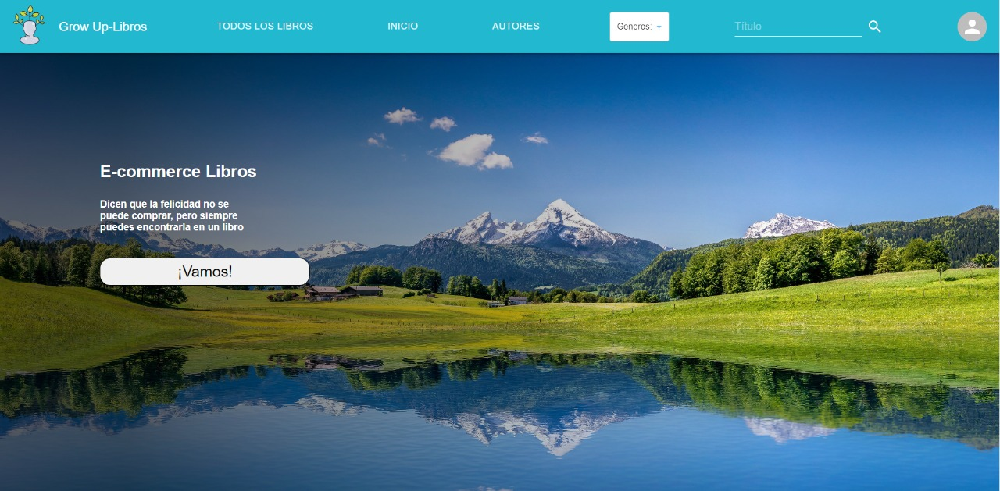

# Hi there, I'm Pedro👋

## Full Stack Web Developer

## Checkout my lastest projects

👇
👇
👇

---

## Grow Up

### A complete e-commerce website about a personal development library and more.

### 🛠️ Technologies: React, Redux, NodeJs, Express, Axios, MongoDb, Mongoose, etc.

---

---
## PI-FOOD
## 

### Quick Start:
#### Clone repository
#### Run the next commands in file root
#### npm install
#### npm start
#### Open http://localhost:3000 in your browser

### 🛠️ Technologies: React, Javascript, React-Redux, Redux, Sequelize.
